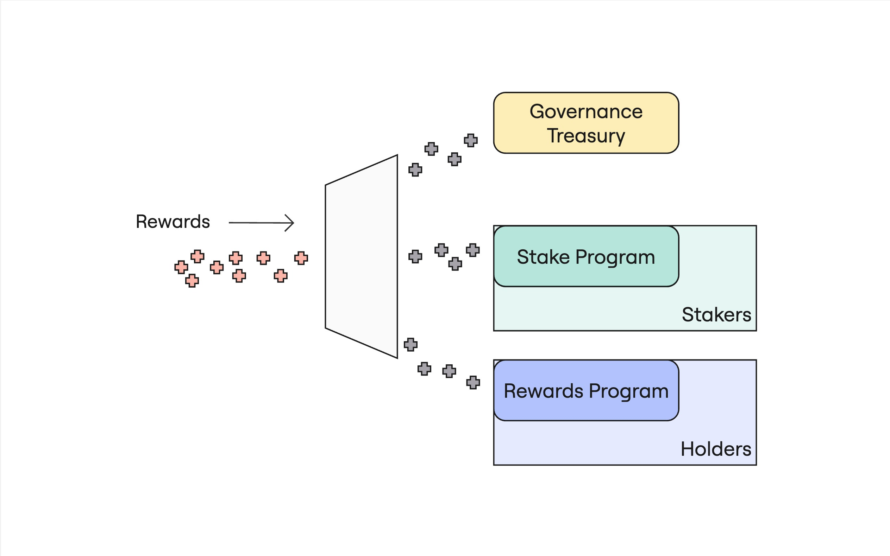

# Paladin Funnel Program

The Paladin Rewards Funnel program is a simple frontward-facing on-chain
program that manages the dispersal of rewards paid into the entire Paladin
system.

Reward shares are distributed across the governance, staking, and holder
ecosystems according to the formula found in the program's processor.

This program has only one instruction - `DistributeRewards` - which accepts an
amount to distribute to the three aforementioned targets. For the treasury,
this is done through a simple transfer. For the staker and holder ecosystems,
each program - Paladin Stake and Paladin Rewards, respectively - have their own
`DistributeRewards` instruction, which this funnel will invoke via CPI.

This program merely provides a simpler mechanism for distributing rewards
according to predefined ratios in an on-chain, transparent manner. There's
nothing this program does that can't be done client-side.