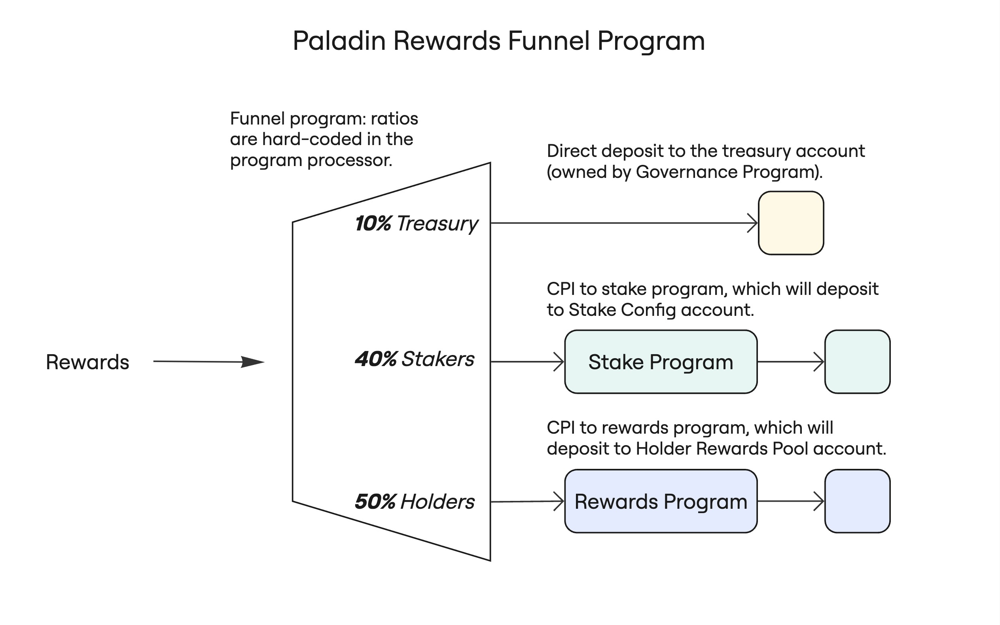

# Paladin Funnel Program

This program serves as the top-level funnel for distributing rewards for the
PAL system.

It allows a payer (ideally some validator running the Paladin bot) to send one
instruction to the funnel to distribute a single amount of rewards according to
the preconfigured distribution ratios.

This program simply sends a percentage of any reward amount to:

- The PAL governance treasury.
- PAL stakers.
- PAL holders.

It does this by transferring to the governance treasury directly as well as
invoking via CPI each program's `DistributeRewards` instruction.

The program contains hard-coded configurations for the proper addresses and
distribution ratios. This allows these configurations to be changed via program
upgrade.

